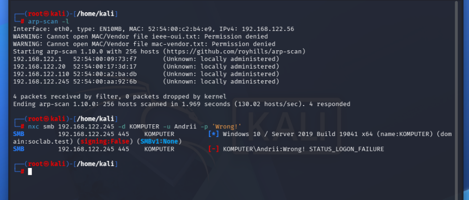
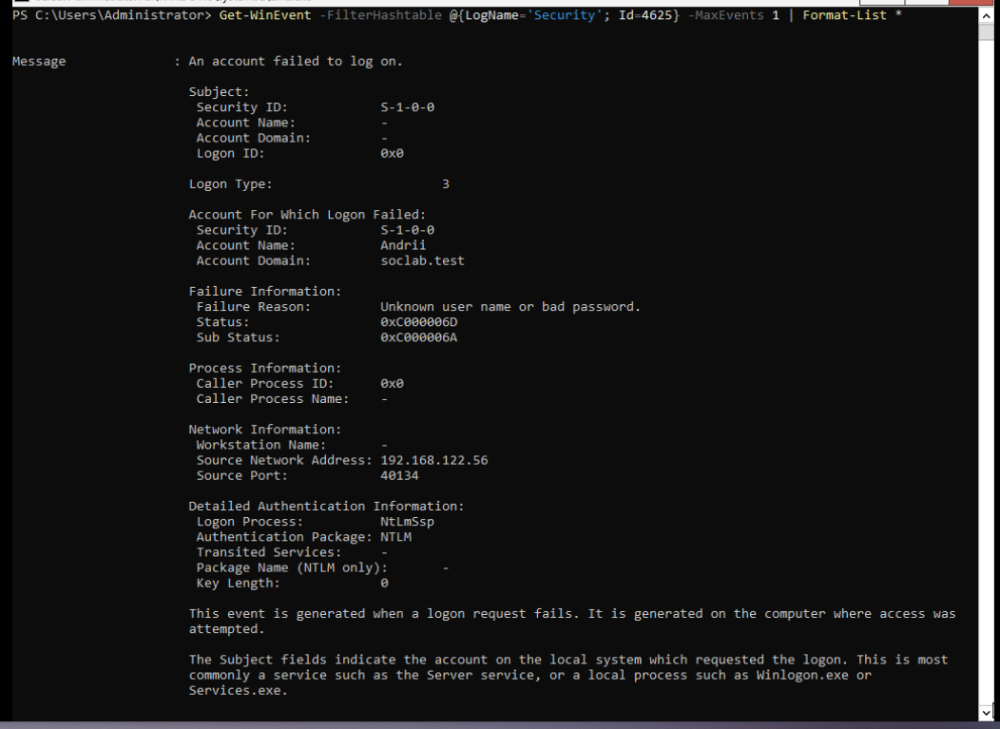
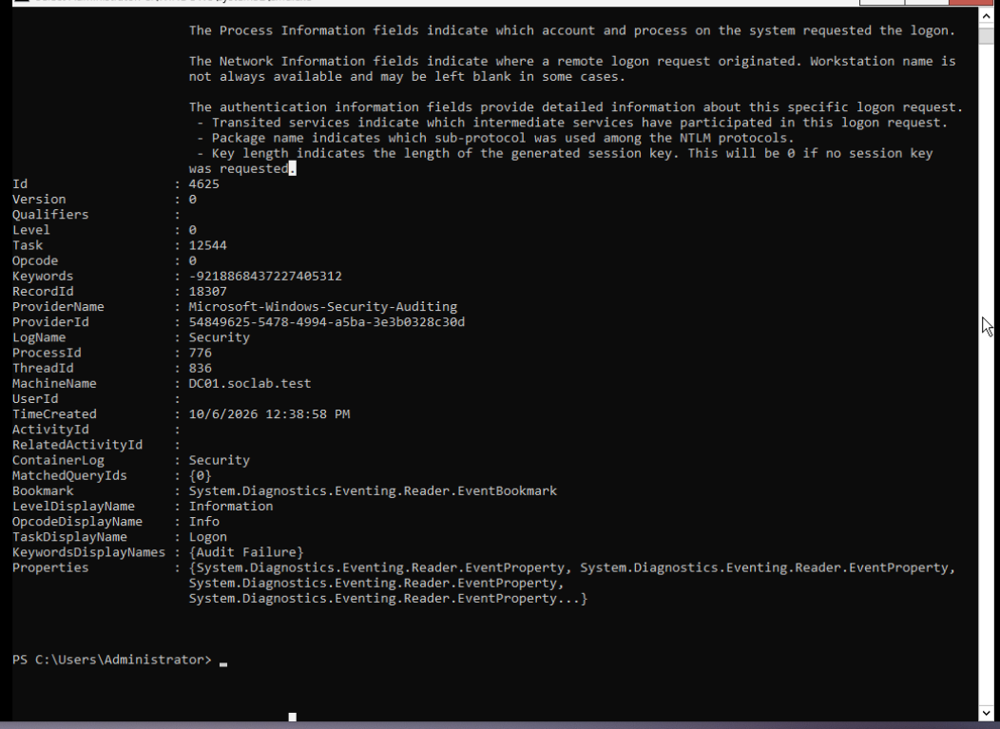
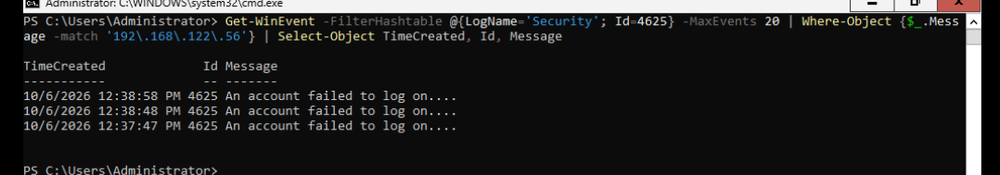
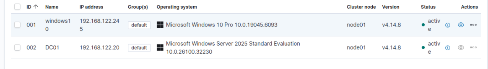
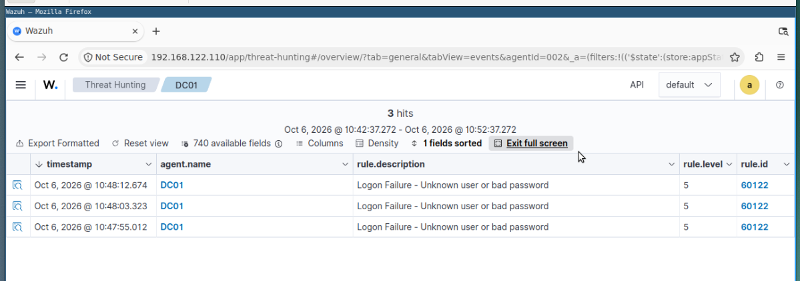

# Active Directory Security Monitoring Lab

## Overview

This project demonstrates a small Windows Active Directory home lab built for blue-team practice.

The goal of the lab is to understand how Windows authentication activity is generated, logged, collected, and investigated from a SOC analyst perspective.

## Lab Environment

- Debian host
- QEMU/KVM
- Windows Server Domain Controller
- Windows client
- Kali Linux
- Wazuh SIEM

## What I Built

- Configured a Windows Active Directory lab
- Deployed a Domain Controller
- Connected Windows telemetry to Wazuh
- Investigated Windows Security events in Event Viewer and Wazuh
- Practiced identifying authentication-related activity
- Compared raw Windows events with SIEM data
- Used Kali Linux as a separate testing machine inside the lab network

## SOC Workflow

1. Generate authentication activity in the lab
2. Review the event on the Windows system
3. Locate the same event in Wazuh
4. Inspect important fields such as:
   - Event ID
   - Username
   - Source IP
   - Logon type
   - Failure reason
   - Timestamp
5. Correlate the activity with the surrounding events
6. Document the findings as a SOC investigation

## Skills Demonstrated

- Active Directory fundamentals
- Windows Security Event Logs
- SIEM monitoring with Wazuh
- Basic threat detection
- Log analysis
- Authentication event investigation
- Linux / Windows lab administration
- Virtual networking
- Blue-team investigation workflow

## Screenshots

### 1. Authentication Failure Simulation

A controlled SMB authentication attempt was generated from the Kali Linux.

The authentication attempt resulted in `STATUS_LOGON_FAILURE`.

### 2. Windows Security Event 4625

The failed authentication was recorded in the Windows Security log as Event ID `4625`.

Key fields observed:

- Event ID: 4625
- Logon Type: 3
- Account: Andrii
- Domain: soclab.test
- Failure Reason: Unknown user name or bad password
- Source IP: 192.168.122.56
- Authentication Package: NTLM

The event was recorded on `DC01.soclab.test`.

### 3. Source IP Correlation

PowerShell was used to filter failed logon events originating from the Kali Linux IP address.

Multiple Event ID 4625 records were identified from `192.168.122.56`.

### 4. Wazuh Monitoring Infrastructure

Both the Windows workstation and Domain Controller were connected to Wazuh.

### 5. SIEM Detection

Wazuh detected the failed authentication activity generated against the Active Directory environment.

Detection details:

- Agent: DC01
- Rule description: Logon Failure - Unknown user or bad password
- Rule level: 5
- Rule ID: 60122
## What I Learned

This lab helped me understand the full path from Windows activity to SIEM visibility.

Instead of only reading about authentication logs, I worked with the events directly, inspected their fields, and used Wazuh to investigate the same activity from a SOC analyst perspective.

## Disclaimer

This project was created in an isolated home lab for educational and defensive security purposes only.
